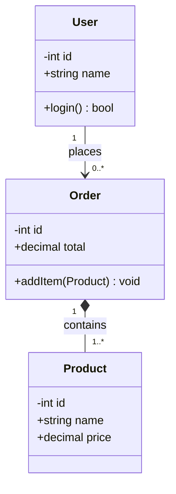

# 15. Способы описания архитектуры разработанного программного обеспечения в текстовой документации и презентации. UML-диаграммы классов

[← К группе «Проектирование ПО»](README.md) · [← Ко всем группам](../README.md)

## План ответа

1. Зачем описывать архитектуру ПО и кому это нужно.
2. Текстовая документация и ADR.
3. Графические нотации: UML, C4, ArchiMate, BPMN.
4. UML как унифицированная нотация: какие диаграммы бывают.
5. Диаграмма классов: что обозначает, отношения, видимость, кратность.
6. Примеры и хорошие практики.

## Развёрнутый ответ

### Зачем описывать архитектуру

**Архитектура программного обеспечения** — это высокоуровневое описание системы: какие в ней есть компоненты, как они общаются, какие принципы и ограничения. Описание архитектуры нужно сразу нескольким аудиториям.

**Команда разработки.** Без общей картины каждый разработчик «видит» только свою часть, и легко принять решения, противоречащие задумке. Архитектурное описание задаёт общий язык.

**Новые сотрудники.** Когда в команду приходит новичок, хорошее архитектурное описание сокращает онбординг с недель до дней.

**Стейкхолдеры и руководство.** Им нужно понимать, как устроена система, какие есть зависимости, что можно изменить без переписывания.

**Эксплуатация и поддержка.** При инцидентах нужно знать, какие компоненты на что влияют, где журналы, как масштабируется нагрузка.

Архитектурное описание делается на двух уровнях: **текстовая документация** для подробностей и **графические диаграммы** для быстрого визуального понимания.

### Текстовая документация и ADR

Текстовая часть обычно включает:

- описание системы и её бизнес-задач;
- ключевые требования (особенно нефункциональные — производительность, доступность);
- описание подсистем и интеграций;
- технологический стек и обоснование выбора;
- риски и трейд-оффы.

Хороший формат для фиксации архитектурных решений — **ADR (Architecture Decision Records)**. Это короткие документы (обычно 1–2 страницы), в которых описывается: **что решили**, **почему**, **какие альтернативы рассмотрели**, **какие последствия**. ADR версионируются вместе с кодом и помогают понять, **почему** через год архитектура выглядит именно так.

### Графические нотации

**UML (Unified Modeling Language)** — самая известная нотация. Стандартизирована OMG в 1997 году. Изначально создавалась для объектно-ориентированного проектирования. Сейчас UML включает 14 типов диаграмм, делящихся на структурные и поведенческие.

**C4 model** — современная альтернатива от Саймона Брауна. Идея: описывать архитектуру на четырёх уровнях зума — **Context** (система и её внешнее окружение), **Container** (крупные исполняемые единицы — приложение, БД, очередь), **Component** (внутренняя структура контейнеров), **Code** (классы внутри компонента). C4 проще UML и популярнее на практике.

**ArchiMate** — нотация для enterprise-архитектуры, описывает не только ПО, но и бизнес-процессы, инфраструктуру, стратегию.

**BPMN (Business Process Model and Notation)** — для бизнес-процессов.

**Mermaid, PlantUML** — текстовые форматы, из которых генерируются картинки. Хороши тем, что диаграммы версионируются вместе с кодом.

### Виды UML-диаграмм

**Структурные диаграммы** (описывают строение):

- **Class Diagram** — классы, их атрибуты, методы, отношения;
- **Object Diagram** — конкретные экземпляры объектов;
- **Component Diagram** — компоненты и их интерфейсы;
- **Deployment Diagram** — где физически развёрнуты компоненты;
- **Package Diagram** — пакеты и зависимости;
- **Composite Structure**, **Profile**.

**Поведенческие диаграммы** (описывают поведение):

- **Use Case Diagram** — функциональность с точки зрения акторов;
- **Activity Diagram** — поток работ, похож на блок-схему;
- **Sequence Diagram** — последовательность сообщений между объектами по времени;
- **Communication Diagram** — те же сообщения, но с акцентом на связях объектов;
- **State Machine Diagram** — состояния объекта и переходы;
- **Timing**, **Interaction Overview**.

В презентации обычно показывают **диаграмму компонентов**, **диаграмму развёртывания**, **диаграмму последовательностей** для ключевого сценария и **диаграмму классов** для центральных абстракций.

### Диаграмма классов

Это **главная структурная диаграмма UML**. Описывает классы системы и их отношения.

**Обозначение класса.** Прямоугольник с тремя секциями: имя, атрибуты, методы.

```
+-----------------------+
|       User            |    ← имя класса
+-----------------------+
| - id: int             |    ← атрибуты
| + name: string        |
| # email: string       |
+-----------------------+
| + login(): bool       |    ← методы
| + logout(): void      |
+-----------------------+
```

**Видимость** обозначается префиксом:

- `+` public — доступно всем;
- `-` private — только внутри класса;
- `#` protected — внутри класса и потомков;
- `~` package — внутри пакета.

**Отношения между классами:**

- **Зависимость (Dependency)** — пунктирная стрелка `- - ->`. Класс использует другой, не храня ссылку.
- **Ассоциация (Association)** — простая линия. Классы знают друг о друге.
- **Агрегация (Aggregation)** — линия с пустым ромбом со стороны целого `◇——`. Отношение «часть-целое», но часть живёт независимо. Пример: автомобиль состоит из колёс, но колёса можно использовать на другом авто.
- **Композиция (Composition)** — линия с залитым ромбом `♦——`. Отношение «часть-целое», и часть умирает вместе с целым. Пример: страницы внутри книги.
- **Наследование (Generalization)** — стрелка с пустым треугольником `——▷`. Указывает «является» (is-a).
- **Реализация (Realization)** — пунктир со стрелкой `- - ▷`. Класс реализует интерфейс.

**Кратность (Multiplicity)** указывается на концах связи: `1`, `0..1`, `*`, `1..*`, `n..m`. Например, `User 1 ─── 0..* Order` означает, что у пользователя ноль или больше заказов.

### Пример (нотация Mermaid)



В этом примере: пользователь может разместить много заказов; заказ содержит один или более товаров (композиция — без заказа товар в заказе не существует как часть этого заказа).

### Другие полезные диаграммы

**Use Case** показывает, какие функции системы доступны каким акторам. Хорошо подходит для общения с заказчиком.

**Sequence Diagram** для одного сценария показывает, в каком порядке какие объекты обмениваются сообщениями. Незаменим для описания протоколов взаимодействия — например, как идёт логин через OAuth.

**Activity Diagram** — это «блок-схема» процесса с ветвлениями и параллельностью. Удобен для описания бизнес-процессов.

**Deployment Diagram** показывает, на каких серверах развёрнуты какие компоненты, какие сети между ними. Полезен для эксплуатации.

### Хорошие практики

**Не пытайтесь описать всё на одной диаграмме.** Перегруженная картинка перестаёт читаться. Лучше несколько диаграмм с разными целями.

**Один уровень абстракции на одной картинке.** Если рядом стоят и крупные компоненты, и микроскопические детали, читатель теряется.

**Имена осмысленные.** `OrderService`, `PaymentGateway`, а не `Service1`, `Manager2`.

**Диаграммы рядом с кодом.** Если использовать Mermaid или PlantUML, исходники диаграмм версионируются в Git, всегда актуальны.

**Документация — это инвестиция.** Хорошее архитектурное описание окупается каждый раз, когда новый сотрудник быстро встаёт в строй или когда команда не повторяет старых ошибок.

### Что важно сказать в итоге

Архитектура ПО описывается на двух уровнях: текстовая документация с обоснованиями (ADR, спецификации) и графические нотации для быстрого восприятия. Главная универсальная нотация — UML с 14 типами диаграмм; в практике также популярны более простые C4 и текстовые Mermaid/PlantUML. Диаграмма классов — основная структурная диаграмма: показывает классы, их атрибуты, методы и отношения (зависимость, ассоциация, агрегация, композиция, наследование, реализация). Хорошее архитектурное описание экономит время команды на коммуникации и онбординге.
